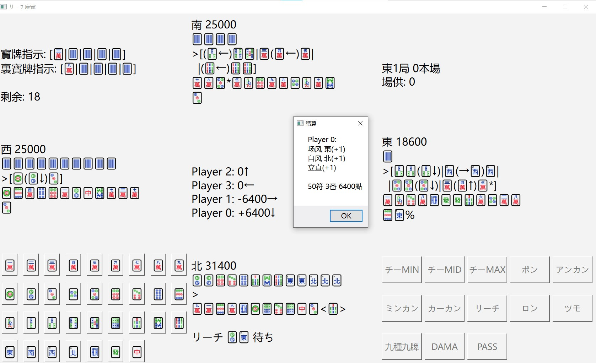

# Qt-Pymahjong

This is a riichi mahjong game, based on `pymahjong==1.0.3` with a simple GUI, using Unicode chars of Mahjong tiles.

Due to the unique mechanism of `pymahjong`, it's awkward sometimes to make the game engine run as a player usually expects. I've tried my best to fit the habit of a common player and hope to make the environment follow the rules as Tenhou or MajSoul.

### Installation

`pip install -r requirements.txt`
`torch` is not included in `requirements.txt` but it's required to install `torch` in the way the user is used to. 

**Note:** For some purpose I modify the base repo of `pymahjong`, and please replace the `env_pymahjong.py` under the initial location (usually under `${CONDA_ENV_LOCATION}/Lib/site-packages/pymahjong/`) with the one given in this repo, or the program may probably NOT FUNCTION well!

### Get checkpoints

From the official release https://github.com/Agony5757/mahjong/releases/v1.0.2 to get the `*.pth` official checkpoints.

### Run

`python qt_ui.py [-n <n_games>]`. For example, for a typical game `n_games=8` by default. The program will automatically maintain honbas.

Other available parameters (at present):

`-f`: Automatically execute a game (feasible for debugging)

`-m`: Disable more games when top points are still not enough

### Mechanisms which may cause behaviour unexpected

#### May be fixed by future work (python code only):

The randomness to choose a tile to An-Kan or Ka-Kan when multiple choices are available (though rare in real senarios)

#### Require diving into the cpp core to fix:

The fixed priority of red doras when discarding or making a call. This seems proper under most cases but may cause some damage under extreme cases (For example, a player decide to make Kokushi but with a pair of 5p in hand with one of red. He discards them sequentially, but the next 5p, literally 0p, is ronned by another player who tenpaied after the first 5p and make the lose points absolutely more.)

### Character notations

`%`: the last tile discarded

`@`: the tile was discarded after drawn, not from hand

`*`: the tile of red dora (Unicode majhong tiles don't have aka-tiles)

ARROWS: indicating where it came from in callings

`<>`: the tile declaring riichi

### Features on the way...

- Show who made a call just the moment
- Customized config to control a game
- More creative ideas perhaps?
- ...